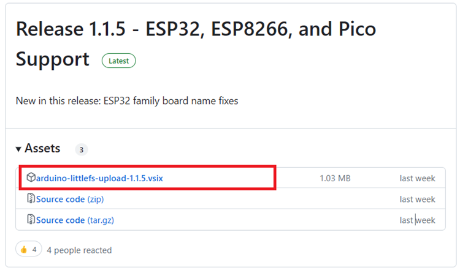
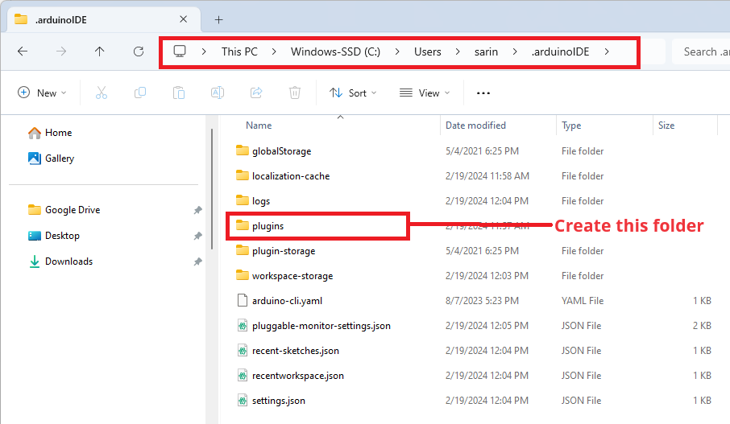
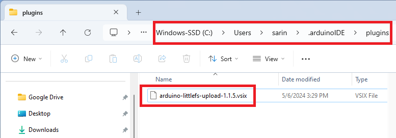
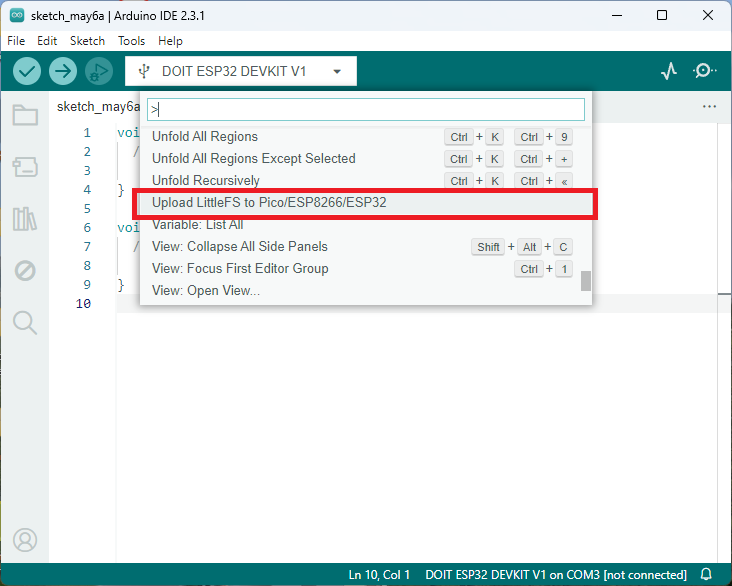
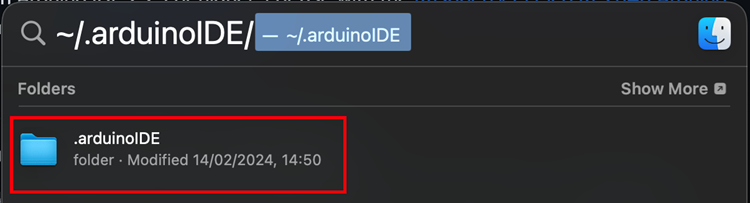
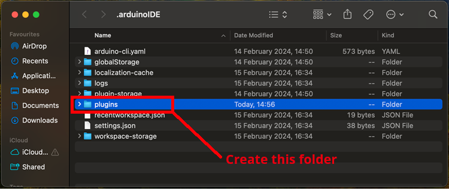
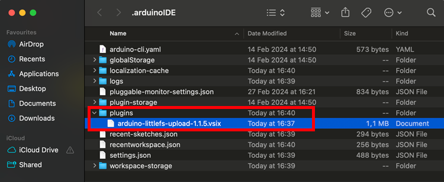
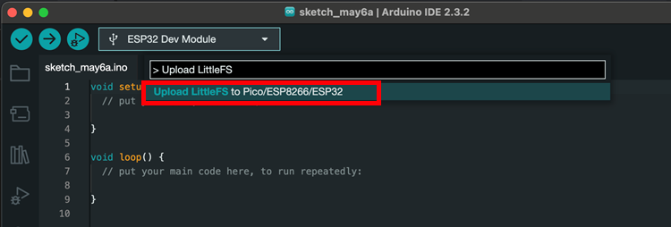
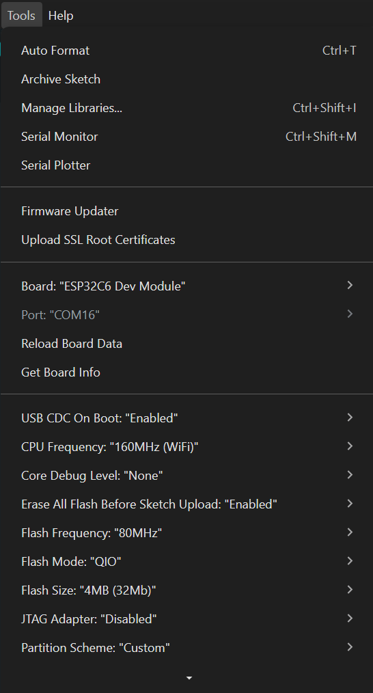
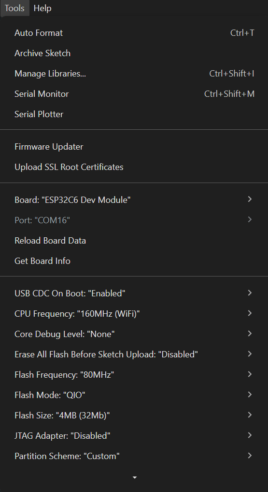

# RC Car Controls

A wireless ESP32-based robotic vehicle controlled via a web interface. The RC Car features software access point (SoftAP) connectivity, motor control for movement in all directions, and real-time control through an intuitive web controller.

## Table of Contents

- [RC Car Controls](#rc-car-controls)
  - [Table of Contents](#table-of-contents)
  - [Project Overview](#project-overview)
  - [Hardware Requirements](#hardware-requirements)
  - [Setup Instructions](#setup-instructions)
    - [secrets.h Configuration](#secretsh-configuration)
    - [Arduino IDE Setup](#arduino-ide-setup)
      - [Board Manager URLs](#board-manager-urls)
      - [Required Libraries](#required-libraries)
    - [LittleFS Code Upload](#littlefs-code-upload)
      - [Downloading and Installing the LittleFS Upload Tool](#downloading-and-installing-the-littlefs-upload-tool)
        - [Windows Instructions](#windows-instructions)
        - [macOS Instructions](#macos-instructions)
      - [Uploading LittleFS Files](#uploading-littlefs-files)
  - [Building and Uploading](#building-and-uploading)
  - [Control Features](#control-features)

## Project Overview

The RC Car is an ESP32-powered robot that connects to a SoftAP and serves a web-based control interface. Users can:

- Control movement (forward, backward, left, right, and diagonal directions)
- Adjust turn sensitivity for smoother cornering
- Rotate a servo 0 to 180 degrees
- Toggle headlights and rear lights
- Monitor the robot in real-time via WebSocket communication

## Hardware Requirements

- ESP32 Development Board
- Motor Driver Module (compatible with the defined GPIO pins)
- 2 DC Motors
- LED modules for headlights and rear lights
- 1 180 degree Digital Servo
- Power supply for motors and ESP32
- USB cable for programming

## Setup Instructions

### secrets.h Configuration

Before uploading the code, you must create a `secrets.h` file in the `MainCode/` folder. This file contains your WiFi credentials.

Create a new file named `secrets.h` in the `MainCode` folder with the following content:

```cpp
#ifndef SECRETS_H
#define SECRETS_H

const char* ssid = "YOUR_SSID";
const char* password = "YOUR_PASSWORD";  // Password needs to be at least 8 characters

#endif // SECRETS_H
```

**Important:**

- Replace `YOUR_SSID` with your actual SoftAP name
- Replace `YOUR_PASSWORD` with your SoftAP password
- WiFi password must be at least 8 characters long
- **Do not commit this file to version control** as it contains sensitive credentials

### Arduino IDE Setup

#### Board Manager URLs

To program the ESP32, you need to add the ESP32 board package to the Arduino IDE. Follow these steps:

1. Open Arduino IDE
2. Go to **File → Preferences**
3. In the "Additional Board Manager URLs" field, add the following URL:

   ```
   https://dl.espressif.com/dl/package_esp32_index.json
   ```

4. Click **OK**
5. Go to **Tools → Board → Boards Manager**
6. Search for "ESP32" and install the latest version by Espressif Systems
7. Select **Tools → Board → ESP32 → ESP32 Dev Module** (or your specific variant)

#### Required Libraries

Install the following libraries in Arduino IDE (**Sketch → Include Library → Manage Libraries**):

| Library               | Author                           | Purpose                                        |
| --------------------- | -------------------------------- | ---------------------------------------------- |
| **ESPAsyncWebServer** | ESP32Async                       | Asynchronous web server for HTTP and WebSocket |
| **AsyncTCP**          | ESP32Async                       | Required dependency for ESPAsyncWebServer      |
| **ESP32Servo**        | Kevin Harrington,John K. Bennett | Used to control the servo motors               |

Installation steps:

1. Open Arduino IDE
2. Go to **Sketch → Include Library → Manage Libraries**
3. Search for each library name above
4. Click **Install** for each one

### LittleFS Code Upload

LittleFS is used to store the web interface files (HTML, CSS, JavaScript) directly on the ESP32. These files are served by the web server.

#### Downloading and Installing the LittleFS Upload Tool

To upload LittleFS to your ESP32, you must install this [LittleFS Uploader plugin](https://github.com/earlephilhower/arduino-littlefs-upload).

##### Windows Instructions

1. Go to the [releases page](https://github.com/earlephilhower/arduino-littlefs-upload/releases) and click the .vsix file to download.



2. On your computer, go to the following path: `C:\Users\<username>\.arduinoIDE\`. Create a new folder called plugins if you haven’t already.



3. Move the .vsix file you downloaded previously to the plugins folder (remove any other previous versions of the same plugin if that’s the case).



4. Restart or open the Arduino IDE 2. To check if the plugin was successfully installed, press **[Ctrl] + [Shift] + [P]** to open the command palette. An instruction called "**Upload Little FS to Pico/ESP8266/ESP32**" should be there (just scroll down or search for the name of the instruction).



##### macOS Instructions

1. Go to the [releases page](https://github.com/earlephilhower/arduino-littlefs-upload/releases) and click the .vsix file to download.


2. In Finder, type `~/.arduinoIDE/` and open that directory.



3. Create a new folder called plugins.



4. Move the .vsix file to the plugins folder (remove any other previous versions of the same plugin if that’s the case).



5. Restart or open the Arduino IDE 2. To check if the plugin was successfully installed, press **[⌘] + [Shift] + [P]** to open the command palette. An instruction called "**Upload LittleFS to Pico/ESP8266/ESP32**" should be there (just scroll down or search for the name of the instruction).



#### Uploading LittleFS Files

Once installed, you should see a new option under the command palette called "**Upload LittleFS to Pico/ESP8266/ESP32**".

To upload the web interface files:

1. Make sure your ESP32 is connected via USB.
2. Select the appropriate COM port where your ESP32 is connected.
3. Ensure the following files are in the `MainCode/data/` directory:
   - `index.html`
   - `style.css`
   - `script.js`
4. Make sure your tools menu looks like mine:



5. Open the command palette and click on the instruction "**Upload LittleFS to Pico/ESP8266/ESP32**" (make sure the Serial Monitor is closed or it will fail).

The upload process will:

- Build the LittleFS filesystem
- Format the ESP32's LittleFS storage
- Upload the files from the `data/` folder

6. Wait for the upload to complete (you'll see "LittleFS Image Uploaded" message)

**Note:** You must upload LittleFS files before uploading the Arduino sketch, as the sketch expects these files to be present.

## Building and Uploading

1. Open `MainCode.ino` in Arduino IDE.
2. Select your board: **Tools → Board → ESP32 → ESP32 Dev Module** (or your specific variant).
3. Select the COM port: **Tools → Port → COM#** (where # is your port number).
4. Ensure you uploaded LittleFS.
5. Click the **Upload** button (→ icon).
6. Ensure your tools menu looks like mine:



7. Wait for the upload to complete.

## Control Features

- **Movement**: Forward, backward, left, right, and four diagonal directions
- **Turret Controll**: 0 to 180 degrees
- **Lights**: Toggle headlights and rear lights on/off
- **Turn Sensitivity**: Adjustable reverse motor percentage for precise turning
- **Real-time Communication**: WebSocket-based control for responsive operation

Once uploaded, the ESP32 will boot up and create a WiFi access point (SoftAP). Connect to the SSID specified in your `secrets.h` file and navigate to the robot's IP address `http://192.168.4.1/` to begin controlling it.
